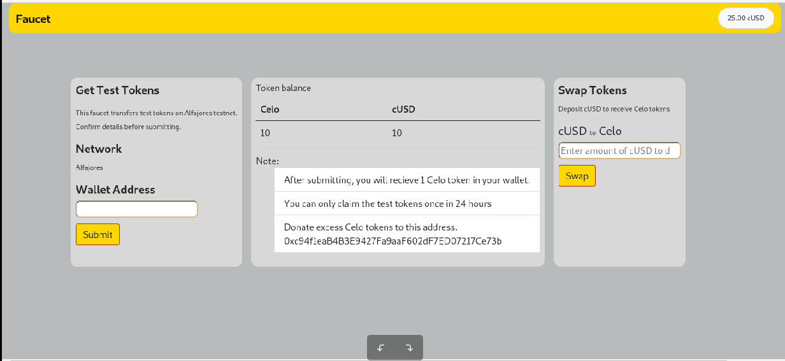
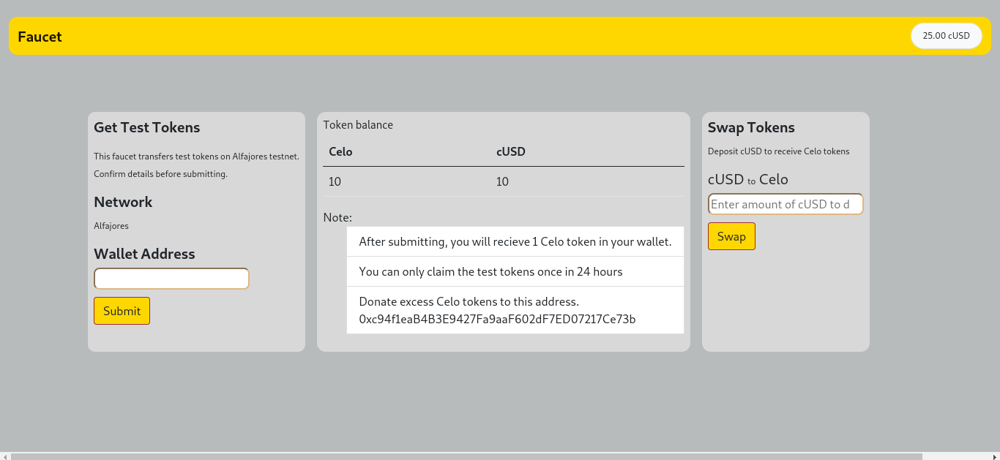

# Beginner's Guide to Building a Token Faucet dapp on the Celo blockchain

## Introduction
Building a token faucet on the Celo blockchain can be an exciting project for developers interested in exploring decentralized finance (DeFi) and blockchain technology. Token faucets are a popular tool in the world of blockchain, as they allow users to obtain a small amount of a particular cryptocurrency for free. This can be useful for testing purposes, user adoption, or community engagement. 

With the Celo blockchain's focus on accessibility and financial inclusion, building a token faucet on this platform can help to provide users with easy access to digital assets and drive the adoption of the Celo ecosystem. In this guide, we will explore the steps involved in building a token faucet on the Celo blockchain, including the necessary tools, resources, and best practices to create a functional and secure faucet and deploy it on the Celo blockchain. Here is a [demo](https://kalondepeace.github.io/Celo-Faucet/) of what we will build. All the code can be found [here](https://github.com/kalondepeace/Celo-Faucet)

### Table Of Contents
- [Introduction](#introduction)
- [Pre-requisites](#prerequisites).
- [requirements](#prerequisites).
- [Smart contract development](#smart-contract-development).
  * [Learning objective](#learning-objective)
  * [Remix IDE](#11--remix-ide).
  * [Solidity File Setup](#12--solidity-file-setup).
  *[ERC20 interface](#13-erc20-interface).
  * [Request Token](#14-request-token-function).
  * [Swap Token](#15-swap-token-function).
  * [Get balance](#16-get-balance-function)
  * [Deploy smart contract](#17-deploy-the-smart-contract-on-the-celo-blockchain).
- [Frontend Development](#front-end-development)
    * [Initializing](#21-initializing-your-project)
    * [The HTML of the dapp](#22-the-html-of-the-dapp-3-minutes)
    * [The JS of the dapp](#23-the-js-of-your-dapp8-minutes)
    * [Interact with the smart contract](#231-interact-with-the-smart-contract)
    * [Connect to Celo blockchain](#232-connect-to-celo-blockchain)
    * [Read user's balance](#233-read-the-users-cusd-token-balance)
    * [Approve function](#234-approve-function)
    * [Event handlers](#24-event-handlers)
    * [window loading for the first time](#241--window-loading-for-the-first-time)
    * [Request tokens from your contract](#242-request-tokens-from-your-contracttime)
    * [Swap token function](#243-swap-token-function)
    * [Contract token balance](#244-contract-token-balance-function)
 - [Host the dapp](#25-host-the-dapp-on-github-pages)
 - [Conclusion](#conclusion)
 - [Author](#author)


## Prerequisites

You need to be familiar with the following:

- Prior knowledge of [javascript](https://developer.mozilla.org/en-US/docs/Learn/Getting_started_with_the_web/JavaScript_basics#:~:text=JavaScript%20is%20a%20programming%20language,styling%3B%20with%20animation%2C%20etc.)
- Familiarity with the command line
- Prior knowledge of [blockchain](http://www.blockchain-basics.com/).
- Prior knowledge of [Solidity](https://soliditylang.org/).


## Requirements

- **[NodeJS](https://nodejs.org/en/download)** from V12. or higher
- A code editor or text editor. [VSCode](https://code.visualstudio.com/download) or [Sublime Text](https://www.sublimetext.com/).
- Terminal or command line
- An Internet Browser and a good internet connection
- **[Remix IDE](https://remix.ethereum.org)**
- **[Celo Extension Wallet](https://chrome.google.com/webstore/detail/celoextensionwallet/kkilomkmpmkbdnfelcpgckmpcaemjcdh?hl=en)**.


## Smart Contract Development

In this chapter, you will learn how to write a smart contract in the popular smart contract language Solidity and deploy it to the Celo blockchain.


#### Learning Objective

- [x] Learn how to write smart contracts in Solidity with the Remix IDE.
- [x] Write a smart contract for a token faucet.
- [x] Deploy your smart contract to the Celo blockchain.

In this tutorial, you will build the following smart contract: [Faucet.sol](./contract/faucet.sol)


### 1.1  Remix IDE.

Remix IDE is an open-source integrated development environment designed for writing, testing, and deploying smart contracts on the Ethereum blockchain. It provides a web-based interface that allows developers to write and compile Solidity smart contracts in their web browser and is full of features such as syntax highlighting, auto-completion, and code debugging. It also includes a built-in compiler that can compile Solidity code and generate bytecode for deployment on the Ethereum network.

Remix IDE is notable for its integration with the Ethereum Virtual Machine (EVM), which allows developers to test their smart contracts locally without needing to deploy them to the Ethereum network. The IDE includes a local blockchain environment that can be used for testing and debugging. Remix IDE also includes several plugins and extensions that can be used to enhance its functionality, such as the Remix Debugger which allows developers to step through their code and analyze the state of variables at each step.


### 1.2  Solidity File Setup

Open [Remix IDE](https://remix.ethereum.org/) in your browser and
create a Solidity file and name it `faucet.sol`

Once the file is created, its time to start developing our smart contract.

```solidity
// SPDX-License-Identifier: MIT  

pragma solidity >=0.7.0 <0.9.0;
```

In the first line, you specify the license the contract uses. Here is a comprehensive list of the available [licenses](https://spdx.org/licenses/.)

Using the `pragma` keyword, you specify the Solidity version that you want the compiler to use. In this case, it should be higher than or equal to seven and lower than nine. It is important to specify the version of the compiler because Solidity changes constantly. If you want to execute older code without breaking it, you can do that by using an older compiler version.


```solidity
contract Faucet {    
}
```

You define your contract with the keyword `contract` and give it a name.


### 1.3 ERC20 Interface

In this tutorial, since you are going to be dealing with token transfers, you need an interface to interact with the tokens and perform actions like transferring tokens.

[IERC20](https://ethereum.org/en/developers/docs/standards/tokens/erc-20/) is an interface for the standard implementation of fungible tokens on the Ethereum blockchain. The acronym stands for "Ethereum Request for Comment 20", and it is a technical standard used to create and interact with tokens that have similar characteristics as the Ethereum cryptocurrency, Ether.

The IERC20 interface outlines a set of functions that a smart contract needs to implement to be considered an ERC20-compliant token. These functions include the ability to transfer tokens between addresses, check an account balance, and get the total supply of tokens. Other essential functions include the approval of an allowance for a delegated transfer and the triggering of an event to notify external applications of token transfers.


```solidity
interface IERC20Token {
  function transfer(address, uint256) external returns (bool);
  function approve(address, uint256) external returns (bool);
  function transferFrom(address, address, uint256) external returns (bool);
  function totalSupply() external view returns (uint256);
  function balanceOf(address) external view returns (uint256);
  function allowance(address, address) external view returns (uint256);

  event Transfer(address indexed from, address indexed to, uint256 value);
  event Approval(address indexed owner, address indexed spender, uint256 value);
}

```
Now we have a way on how to interact with our tokens.


```solidity
   address internal celoTokenAddress = 0xF194afDf50B03e69Bd7D057c1Aa9e10c9954E4C9;

   uint ERC20_DECIMALS = 18;
```

Create a variable `celoTokenAddress`. first, by specifying its type(address). Then you can specify its visibility using the keyword  `internal` because you want the variable to only be accessed inside the contract. [Learn more on visibility](https://docs.soliditylang.org/en/v0.8.18/contracts.html#visibility-and-getters)

Assign it the contract address of the token(CELO), that we will be using in this tutorial.

You declare a variable `ERC20_DECIMALS`, of type `uint`. Assign it the number 18, which is the number of decimals the CELO token has. [learn more on token decimals](https://docs.openzeppelin.com/contracts/3.x/erc20)


### 1.4 Request Token Function

In this section, you will enable users to request test tokens from the faucet.
Here is how the dapp will work.
When a user requests test tokens, they will receive 1 CELO.
Users will only be able to request tokens once per 24 hours.

```solidity

contract Faucet{
  mapping (address => uint) public lastRequest;

  uint requestAmount = 10 ** ERC_DECIMALS;

    /**
      * @dev Requests for CELO tokens can only be performed once every 24 hrs for an address
      * @notice Requests CELO tokens from the faucet
     */
    function requestTokens(address _to) public {
        require(
            (lastClaim[_to] + 1 days) < block.timestamp,
            "You only claim once in 24 hours"
        );

        require(
            IERC20Token(celoTokenAddress).balanceOf(address(this)) >=
                requestAmount,
            "Insufficient funds"
        );

        lastClaim[_to] = block.timestamp;

        require(
            IERC20Token(celoTokenAddress).transfer(payable(_to), requestAmount),
            "token claim failed"
        );

        emit CELOTransfer(address(this), _to, requestAmount);
    }
}
```
To track the last time the user requested tokens, create a variable called `lastRequest`. It is of type `mapping`. Mappings allow you to store key-value pairs. The mapping `lastRequest` will have its keys be the addresses of users, and the values will be the last time they requested the tokens. [learn more on mapping](https://docs.soliditylang.org/en/v0.8.18/types.html#)

You also declare a variable `requestAmount`, of type `uint`. Assign it the number of tokens the user will receive, in our case 1 CELO.

Next, create a function to let a user request tokens from the faucet and name it `requestTokens`.

You have to specify the type of parameter the function takes. In this case, an address parameter called `_to`. This is the address of the user who will receive the tokens.

You also define the visibility of the function as `public`.

Inside the function, first, check the last time the user requested the tokens. It should be more than 24 hours from the current time. 

You make sure this condition is always met before sending the tokens, by using the keyword `require`. If the condition inside the require method fails, the whole function will stop executing and any changes made to the state is reverted. [Learn more about require](https://docs.soliditylang.org/en/v0.8.18/control-structures.html#error-handling-assert-require-revert-and-exceptions)


Next, you check to make sure the smart contract has enough CELO tokens to send to the user. 

If all the above conditions are met, you update the last time that the user requested the tokens. Assign it the `block.timestamp`, which references the time when the function was executed. block.timestamp is a global variable. [Learn more about global variables](https://docs.soliditylang.org/en/v0.8.17/units-and-global-variables.html)

Lastly, you go ahead and transfer the amount of tokens requested from the contract to the user's address and the event `CELOTransfer` is emitted.


### 1.5 Swap Token Function

What should happen if a user needs more tokens when the 24-hour gap has not elapsed? In this section, you will enable the user to receive CELO tokens by completing a certain task. 

The task for our case is depositing another token(cUSD) in our smart contract and in return, a user will receive an equivalent amount of CELO tokens in their wallet.

```solidity
contract Faucet{

address internal cUsdTokenAddress =0x874069Fa1Eb16D44d622F2e0Ca25eeA172369bC1;

    /**
      * @notice Swaps cUSD for CELO
      * @param _amount the amount to swap
     */
    function swapToken(uint256 _amount) public {
        uint256 celoAmount = _amount;

        require(
            IERC20Token(celoTokenAddress).balanceOf(address(this)) >=
                celoAmount,
            "Insufficient funds"
        );

        require(
            IERC20Token(cUsdTokenAddress).transferFrom(
                msg.sender,
                address(this),
                _amount
            ),
            "Transfer failed"
        );

        emit cUSDTransfer(msg.sender, address(this), _amount);

        require(
            IERC20Token(celoTokenAddress).transfer(
                payable(msg.sender),
                celoAmount
            ),
            "swap failed"
        );
        emit CELOTransfer(address(this), msg.sender, celoAmount);
    }
  }

```
Declare a variable `cUsdTokenAddress` of type `address` and assign it the address of the token(cUSD) that the user will be depositing. 

Next, create a function `swapToken` to let the user deposit cUSD tokens and receive CELO tokens. The function is `public` because you want it to be accessible from outside the contract.


>Notice:
For this tutorial, you have used two tokens that have the same number of decimals. An amount in one token when converted to another token does not change. In real-world applications, you may interact with tokens that have different decimals.

Inside the function, create a variable of type `uint` and assign it the `amount` of tokens that the user has deposited. You will send the exact amount the user deposits but in a different token.

Next, check that the smart contract has the amount that the user has requested to deposit. 

First, transfer the cUSD from the user's wallet to the smart contract. Then transfer an equivalent amount of CELO tokens from the smart contract to the user's wallet address.

It is worth noting that two events are emitted where the `cUSDTransfer` event is for the cUSD deposit to the smart contract and the `CELOTransfer` event is for the CELO transfer to the user.

If any of the transfers fail, the smart contract will revert the transaction and display an error message.


### 1.6 Get balance Function

In this section, you will write a function to show the user the amount of cUSD and CELO tokens stored in the smart contract

```solidity
contract Faucet{

   function contractTokenBalance() public view returns(uint _celoBalance,uint _cUSDBalance){
        return (
          IERC20Token(celoTokenAddress).balanceOf(address(this)),
          IERC20Token(cUsdTokenAddress).balanceOf(address(this))
        );
    }
  }
```
Create a function `contractTokenBalance`. It doesn't take in any parameter because it will only return the balance of the smart contract. It is of type `view`. This means that the function can only read the state but is unable to make any changes to the state. [Learn more on View and Pure functions](https://solidity-by-example.org/view-and-pure-functions/)

The function returns two values `_celoBalance` and ` _cUSDBalance`, of type `uint`. 


Inside the function, you will use the keyword `return` to return the CELO token balance and cUSD token balance of the smart contract. Using the ERC20 token interface and the address of the token, you call the `balanceOf` method. It takes in one parameter which is the address we want to read the balance.

You access the address of the contract using the `address(this)` method because you want to return its balance.

You check for the balance of the two tokens stored in the smart contract.


### 1.7 Deploy the Smart Contract on the Celo blockchain.

In this section, you will create a Celo wallet and deploy your contract to the Celo testnet Alfajores.
A tutorial on how to deploy on the CELO blockchain can be found [here](https://docs.celo.org/developer/deploy/remix).


If you follow all the steps in the above guide, you should be able to deploy your contract on the Celo blockchain. 

## Front End Development

In this chapter, you will create learn to build a user interface for your dapp, and connect it to your smart contract.

### Learning objective

- [x] Learn how to write the HTML and JS part of your DApp.
- [x] Connect your DApp to your smart contract on the Celo blockchain with the library ContractKit.
- [x] Learn how to request tokens from the smart contract
- [x] Learn how to swap a token for another.


**Reading time : (13 minutes)**

At the end of this chapter, you should have something similar to this. (User Interface of the faucet dapp).



### 2.1 Initializing your project.

To speed up the development process, you are going to use a boilerplate. It comes with the necessary libraries and packages required for our dapp.

1 Open your terminal and clone the boilerplate from the following repository

```bash
git clone https://github.com/kalondepeace/faucet-boilerplate-template.git
```

2. Navigate to the new repository

```bash
cd faucet-boilerplate-template
```

3. Now, install all dependencies

```bash
npm install
```

4. Start a local development server

```bash
npm run dev
```
Your project should be up and running. Access it on http://localhost:3000 in your browser


### 2.2 The HTML of the Dapp (3 minutes)

In this section, you will start with the basics of your dapp, the HTML.

Using your favorite code editor, open the `index.html` file inside the `public` folder of the project

```html
<!DOCTYPE html>
<html>
<head>
  <!DOCTYPE html>
<html lang="en">
  <head>
    <!-- Required meta tags -->
    <meta charset="utf-8" />
    <meta name="viewport" content="width=device-width, initial-scale=1" />
```
Start by declaring the `document` type, followed by the `head` element and `meta` tags.


```html
<link
      href="https://cdn.jsdelivr.net/npm/bootstrap@5.0.0-beta2/dist/css/bootstrap.min.css"
      rel="stylesheet"
      integrity="sha384-BmbxuPwQa2lc/FVzBcNJ7UAyJxM6wuqIj61tLrc4wSX0szH/Ev+nYRRuWlolflfl"
      crossorigin="anonymous"
    />
    <link
      rel="stylesheet"
      href="https://cdn.jsdelivr.net/npm/bootstrap-icons@1.4.0/font/bootstrap-icons.css"
    />
     <link rel="preconnect" href="https://fonts.gstatic.com" />
  <link
    href="https://fonts.googleapis.com/css2?family=DM+Sans:wght@400;500;700&display=swap"
    rel="stylesheet"
  />

  <title>Faucet</title>

</head>
```
Import external stylesheets, one of which is Bootstrap, a popular front-end library that allows you to create responsive websites with ease.[Learn more on Bootstrap](https://getbootstrap.com/)

And then, add a title.

```html
  <style type="text/css">
    .overall{
      background-color: rgb(183, 187, 188);
      margin-top: 70px;
      margin-left: 100px;
    }

    .first{
      border-radius: 12px;
      margin: .5rem;
      padding: 1rem;
      outline-offset: 0.5rem;
      background-color: #D8D8D8;
    }
    .second{
      border-radius: 12px;
      margin: .5rem;
      padding: 1rem;
      outline-offset: 0.5rem;
      background-color: #D8D8D8;

    }

    span{
      font-size: 12px;
    }

    h4{
      font-size: 20px;
      font-weight: bold;
    }
    h3{
      font-size: 15px;
    }
    .third{
      border-radius: 12px;
      margin: .5rem;
      padding: 1rem;
      outline-offset: 0.5rem;
      background-color: #D8D8D8;
    }

    body{
     background: rgb(183, 187, 188);
    }

    .navbar{
      border-radius: 12px;
      background-color: gold;
    }

    input{
      border-radius: 8px;
      border-color: burlywood;

    }
    .divSpace{
      margin-top: 15px;
    }

    .fir{
      border-radius: 10px;
      border-color: burlywood;
    }
    .btn{
      margin-top: 10px;
      border-color: brown;
      background-color: gold;
    }
  </style>

```
Add some CSS to add some design to the page.

```html 
<body>
<div class="container mt-2" style="max-width: 72em">
  <nav class="navbar bg-success navbar-light">
        <div class="container-fluid">
          <span class="navbar-brand m-0 h4 fw-bold">Faucet</span>
          <span class="nav-link border rounded-pill bg-light">
            <span id="balance">0</span>
            cUSD
          </span>
        </div>
      </nav>
```
Inside the body tag, create a naviagtion bar to display the name of the dapp and the cUSD balance.


```html
<div class="alert alert-warning sticky-top mt-2" role="alert">
    <span id="notification">⌛ Loading...</span>
</div>

```
Create a div for the notifications that you want to display to the user. This div has the class `alert` that you will later select in your JS code. The span element has the id `notification`, that you will use to insert a notification text that you want to display.


```html

<main id="faucet" class="row"></main>
```
Add the main tag with the id `faucet`. We will render our content inside this tag.

You will use flex box to display three div elements inside the main tag.

```html
 <div class="d-flex flex-row overall">
  <div class="d-flex flex-row first">
    <div class="p-2 fir">
      <h4>Get Test Tokens</h4>
      <div class="divSpace">
        <span>This faucet transfers test tokens on Alfajores testnet.</span><br>
        <span>Confirm details before submitting.</span>
      </div>
      <div class="divSpace">
        <h4>Network</h4>
        <span>Alfajores</span>
      </div>
      <div class="divSpace">
        <h4>Wallet Address</h4>
        <input type="text" name="test" id="toAddress">
      </div>
      <button class="btn" type="submit" id="requestTokenId">Submit</button>
    </div>
```

The first div displays an interface to enable the user to request tokens from the dapp.

```html
<div class="p-2 second">
    <h3>Token balance</h3>
    <table class="table table-fixed">
      <thead class="thead-dark">
        <tr>
          <th scope="col">Celo</th>
          <th scope="col">cUSD</th>
        </tr>
      </thead>
      <tbody>
        <tr>
          <td id="celoBal">loading...</td>
          <td id="cUSDBal">loading...</td>
        </tr>
      </tbody>
    </table>

     Note: 
    <ol type="1" >
      <li class="list-group-item">After submitting, you will recieve 1 CELO token in your wallet.</li>
      <li class="list-group-item">You can only claim the test tokens once in 24 hours</li>
       <li class="list-group-item">Donate excess CELO tokens to this address.<br>0xc94f1eaB4B3E9427Fa9aaF602dF7ED07217Ce73b</li>
    </ol>
  </div>
</div>

```
Inside the second div element, create a table element to display the token balances from the smart contract.
Then, create an ordered lsit element to display some notice for the user.

The last list item displays the address of the smart contract because you want a user to send excess test tokens back to the smart contract.


```html
<div class="p-2 third">
            <h4>Swap Tokens</h4>
            <span>Deposit cUSD to receive CELO tokens</span><br>
            <div class="divSpace">
              <h5>cUSD <span>to</span> CELO</h5>
              <input type="number" name="swapAmount" id="swapAmount" placeholder="Enter amount of cUSD to deposit">
            </div>
            <button class="btn" type="submit" id="swapToken">Swap</button>
          </div>

        </div>
      </main>
    </div>
```
Create a div element to enable a user to swap cUSD tokens for CELO tokens.


Here is how the dapp should like with only the HTML now.



### 2.3 The JS of your Dapp(8 minutes)

In this section of the tutorial, you will add the basic functionality of your dapp. You will create a functioning dapp in vanilla Javascript with sample products that are not yet connected to the Celo blockchain.


#### 2.3.1 Interact with the smart contract

In this section of the tutorial, you are going to use the `contractKit` library to interact with the Celo Blockchain. ContractKit includes web3.js, a very popular collection of libraries also used for Ethereum, that allows you to get access to a `web3` object and interact with a node's JSON RPC API (Learn more about contractKit).

To interact with your smart contract, you need its [ABI(Application Binary Interface)](https://docs.soliditylang.org/en/v0.8.13/abi-spec.html). When you compile the contract in Remix, you create an ABI in JSON format. copy it and paste it in the `faucet.abi.json` file inside the contract folder.


```js
import Web3 from 'web3'
import { newKitFromWeb3 } from '@celo/contractkit'
import BigNumber from "bignumber.js"
import faucetAbi from '../contract/faucet.abi.json'
import erc20Abi from "../contract/erc20.abi.json"

const ERC20_DECIMALS = 18
let kit
let contract
let accounts
```
In the `main.js `file inside the `src` folder
Import the `newKitFromWeb3`, `Web3`, and `BigNumber` objects from their respective libraries.

Many Celo operations operate on numbers that are outside the range of values used in Javascript. In this case we will use `bignumber.js` because it can handle these numbers.

Create the variable ERC20_DECIMALS and set it to 18. By default, the ERC20 interface uses a value of 18 for decimals. Since cUSD, the Celo currency that you are going to use here, is an ERC20 token, you will use the ERC20_DECIMALS variable to convert values into Big Numbers.

You should also declare global variables for contractKit, contract and accounts because you are going to need them for multiple functions.

```js
const faucetContractAddress = "0x3d750214E24A89C9a0A2259421AE361dA1753D67"

const celoCOntractAddress = "0xF194afDf50B03e69Bd7D057c1Aa9e10c9954E4C9"

```
When you delpoy the contract, you will need its address in order to interact with it. Declare two variables; `faicetContractAddress` to hold the address of the contract and `celoContractAddress` to hold the address of the celo token


#### 2.3.2 Connect to Celo Blockchain

In this section, you will create a function to connect to the Celo Extension Wallet.

```js
const connectCeloWallet = async function () {
  if (window.celo) {
      notification("⚠️ Please approve this DApp to use it.")
    try {
      await window.celo.enable()
      notificationOff()

      const web3 = new Web3(window.celo)
      kit = newKitFromWeb3(web3)

    } catch (error) {
      notification(`⚠️ ${error}.`)
    }
  } else {
    notification("⚠️ Please install the CeloExtensionWallet.")
  }
}
```


Create a new asynchronous function called `connectCeloWallet` that you will then use to connect to the Celo Blockchain and read the balance of the user.

First, check if the user has installed the CeloExtensionWallet. Do that by checking if the “window.celo” object exists. If it doesn’t exist, use a notification to let them know that they need to install the wallet.

If the object does exist, send them a notification that they need to approve this DApp and try the "window.celo.enable()" function. This will open a pop-up dialogue in the UI that asks for permission to connect the dapp to the CeloExtensionWallet. After the connection has been successful, you should disable the notification.

If you catch an error, let the user know that they must approve the dialogue to use the dapp.

Once the user approves the DApp, create a `web3` object using the "window.celo "object as the provider. With this web3 object, you can create a new kit instance that you can save to the global kit variable. Now, the functionality of the connected kit can interact with the Celo Blockchain.


```js
 const accounts = await kit.web3.eth.getAccounts()
      kit.defaultAccount = accounts[0]
```
Add this code beneath the kit instance in your `connectCeloWallet` function. This returns an array of addresses of the connected user. The first address in the array is set as the default account


#### 2.3.3 Read the user's cUSD token balance

In this section, you will create a function to read the cUSD balance of the user on the Celo blockchain

```js
const getBalance = async function () {
  const totalBalance = await kit.getTotalBalance(kit.defaultAccount)
  const cUSDBalance = totalBalance.cUSD.shiftedBy(-ERC20_DECIMALS).toFixed(2)
  document.querySelector("#balance").textContent = cUSDBalance
}
```
Create an asynchronous function `getBalance`. With the kit’s method `kit.getTotalBalance`, you can get the total balance of an account. In this case, you want the balance from the account that interacts with the CeloExtensionWallet, the one you stored in `kit.defaultAccount`.

In the next line, you get a readable cUSD balance. Use `totalBalance.cUSD` to get the cUSD balance. Since it’s a big number, convert it to be readable by shifting the value's decimal point by 18 places to the left and using toFixed(2) to display only two decimal places after the decimal point.

Display the cUSD balance in the corresponding HTML element.

#### 2.3.4 Approve Function

```js


async function celoApprove(_price) {
        const CELOContract = new kit.web3.eth.Contract(erc20Abi, celoCOntractAddress)

        const result = await CELOContract.methods
          .approve(faucetContractAddress, _price)
          .send({ from: kit.defaultAccount })
        return result
      }
```

### 2.4 Event handlers
In this section, you will learn about adding event listeners and handling events.


#### 2.4.1  Window loading for the first time.

```js
window.addEventListener('load', async () => {
  notification("⌛ Loading...")
  await connectCeloWallet()
  await getBalance()
  await getContractBalance()
  notificationOff()
});
```

When the window loads for the first time, you want to show the user that the page is loading using the notification function.

Then you run a function to connect to the Celo wallet.

Next, Get the balance of the wallet connected to the Dapp and finally retrieve the token balance of the smart contract.


#### 2.4.2 Request tokens from your contract(time)

In this section of the tutorial, you will connect to your smart contract, as well as request tokens from it when a certain event happens.

```js
  document
  .querySelector("#requestTokenId")
  .addEventListener("click", async (e) => {
   
    const addr = document.getElementById("toAddress").value

     notification("Requesting tokens, Please wait")
    try{

      const result = await contract.methods
        .requestTokens(addr)
         .send({from: kit.defaultAccount})

         notification("Request successful")

    }catch(error){
      console.log(error)
    }

  })
```
When the user clicks on a button with the id `requestToken`, you get the value of the element with the id `toAddress`. This will be the address that wants to receive the test tokens.

Notify the user of what is happening.

Call the requestToken function. It takes in one parameter, the address of the wallet to receive the tokens.

If there is an error in the function execution, you will display a message to the user.


#### 2.4.3 Swap token function
In this section, you will learn how to create a swap token function to allow a user to exchange their cuSD tokens for Celo tokens.

```js
const cUSDContractAddress = "0x874069Fa1Eb16D44d622F2e0Ca25eeA172369bC1"

async function cUSDApprove(_price) {
        const cUSDContract = new kit.web3.eth.Contract(erc20Abi, cUSDContractAddress)

        const result = await cUSDContract.methods
          .approve(faucetContractAddress, _price)
          .send({ from: kit.defaultAccount })
        return result
      }
```
 Create a variable `cUSDContractAddess` to hold the contract address of the cUSD token.

 Next, create a copy of the `celoApprove` function and modify it to cater for cUSD.

```js
  document
  .querySelector("#swapToken")
  .addEventListener("click", async (e) => {
    
    notification("Awaiting swap aproval of the token, Please wait")
    const tokenAmount = BigNumber(document.getElementById("swapAmount").value)
              .shiftedBy(ERC20_DECIMALS)
                        .toString()
    
    try{

      await cUSDApprove(tokenAmount)

      const result = await contract.methods
        .swapToken(tokenAmount)
         .send({from: kit.defaultAccount})

         notification("Swap successful")

    }catch(error){
      notification(error)
    }

```
When the user clicks on a button with the id swapToken, you get the value of the element with the id `swapAmount`. This is the amount of cUSD the user wants to swap.
You convert the value to a Big Number with 18 decimals using the BigNumber method.

Next, call the `cUSDApprove` function to allow the smart contract to spend funds on behalf of the user.
The function takes in one parameter, which is the amount the user wants to spend.

Then call the `swap` function on the contract. This will deduct the cUSD from the user's account and in exchange, deposit an equivalent number of CELO tokens to the user's address.


#### 2.4.4 Contract token balance function
In this section, you will learn how to write a function to get the balance of the tokens from the smart contract.

```js
 async function getContractBalance(){
    console.log("working")

    try{
      const balance = await  contract.methods
      .contractTokenBalance()
      .call()

      document.querySelector("#celoBal").textContent = `${BigNumber(balance._celoBalance).shiftedBy(-ERC20_DECIMALS)}`
      document.querySelector("#cUSDBal").textContent = `${BigNumber(balance._cUSDBalance).shiftedBy(-ERC20_DECIMALS)}`
      
      console.log("token balance",balance)

    }catch(error){
      console.log(error)
    }
  }
```

Declare an async function `getContractBalance`. Inside the function, call the `contractTokenBalance` method on the smart contract. It returns an object containing the CELO and cUSD token balance for the smart contract. 

Next, update the text context of the elements with ids `celoBal` and `cUSDBal` with their values respectively. 

In case of an error, display an error message to the user.

```js
function notification(_text) {
  document.querySelector(".alert").style.display = "block"
  document.querySelector("#notification").textContent = _text
}

function notificationOff() {
  document.querySelector(".alert").style.display = "none"
}

```
Create a `notification` function that displays the alert. It takes in a text as the parameter and a `notificationOff` function that stops showing the alert message.


 ### 2.5 Host the dapp on Github Pages

 In this section, you will learn how to host your completed project on GitHub Pages.

After testing that your dapp works correctly, it is time to build your dapp. Run this command in your terminal

```bash
npm run build
```

Upon completion, you will now have a new folder `docs` containing an `index.html` and `main.js` file.

- Upload your project to a new GitHub repository.
- Once inside your repository, click on settings and scroll down to a section called GitHub Pages.
- Select the `master` branch and the docs folder as the source for your GitHub pages.

Congratulations, you have made it to the end. You now have a fully functional dapp running on the Celo blockchain.

## Conclusion
In this tutorial, you have learned how to build a full stack faucet dapp running on Celo blockchain, and deploy it to GitHub Pages. With the knowledge gained, you can now apply it to build more fully functional dapps.

## Author

Peace is a Computer Engineering Student. She is passionate about new and trending technologies.
For contributions, feel free to check my [GitHub](https://github.com/kalondepeace) account.


